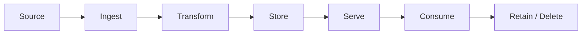
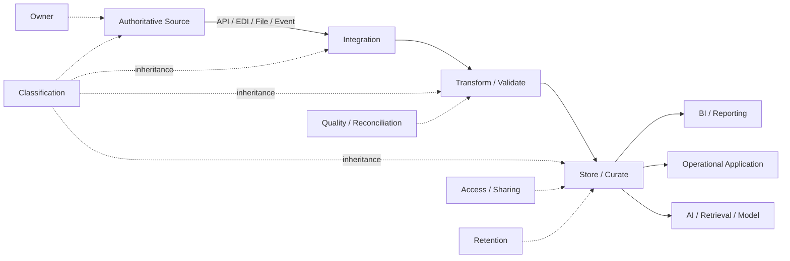
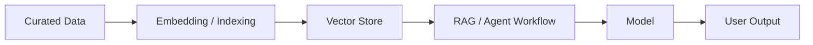

# Data Lineage Diagrams — Draft

## Core model

```mermaid
flowchart LR
    A[Source] --> B[Ingest]
    B --> C[Transform]
    C --> D[Store]
    D --> E[Serve]
    E --> F[Consume]
    F --> G[Retain / Delete]
```

## Governance overlay

```mermaid
flowchart LR
    SRC[Authoritative Source] -->|API / EDI / File / Event| INT[Integration]
    INT --> TR[Transform / Validate]
    TR --> STORE[Store / Curate]
    STORE --> BI[BI / Reporting]
    STORE --> APP[Operational Application]
    STORE --> AI[AI / Retrieval / Model]

    OWN[Owner] -.-> SRC
    CLS[Classification] -.-> SRC
    CLS -. inheritance .-> INT
    CLS -. inheritance .-> TR
    CLS -. inheritance .-> STORE
    QUAL[Quality / Reconciliation] -.-> TR
    ACC[Access / Sharing] -.-> STORE
    RET[Retention] -.-> STORE
```

## AI lineage example

```mermaid
flowchart LR
    CUR[Curated Data] --> EMB[Embedding / Indexing]
    EMB --> VS[Vector Store]
    VS --> RAG[RAG / Agent Workflow]
    RAG --> MODEL[Model]
    MODEL --> OUT[User Output]
```
